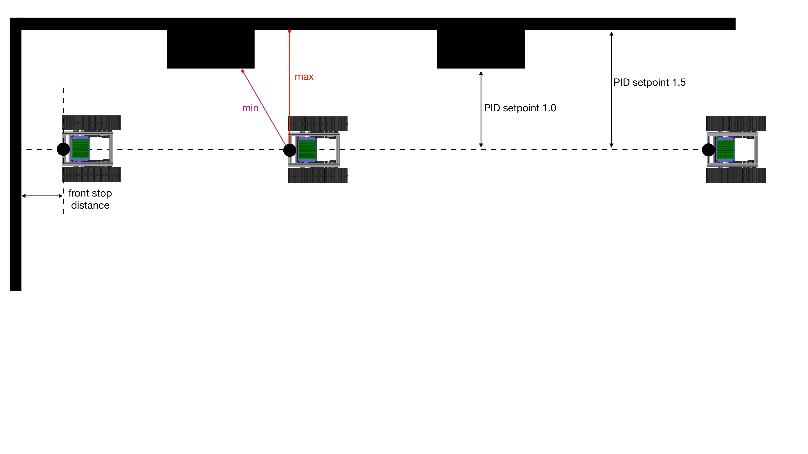
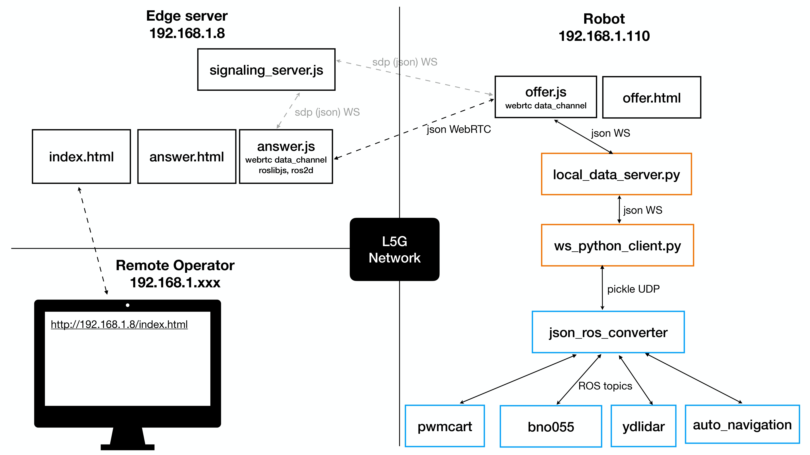

# Ginzafarm Sumitomo L5G Robot

This repository is part of Sumitomo L5G robot project, this repo is taking care of robot control. The WebRTC part is taking care by [sumitomo_l5g_web_console](https://github.com/attraclab/sumitomo_l5g_web_console) repo.

## Software Dependencies

- [jmoab-ros](https://github.com/rasheeddo/jmoab-ros)
- [ydlidar_ros_driver](https://github.com/YDLIDAR/ydlidar_ros_driver)
- `sudo pip3 install simple-pid`

## Algorithms

The idea is to use wall-following PID control to make the robot navigate in straight line until it found the front wall then U-turning around to come back to start point. The enviroment is uneven wall, there are huge pillar pop out from the wall like a step. In order to let the robot moves straight with this environment, the PID setpoint is decided by checking minimum and maximum distance from LIDAR. Normally, the PID setpoint is 1.5 meters, the PID input is from average of minimum and maximum distance of laserscan range. But once the min distance found that it less than 1 meter, then it could be considered that there is a pillar. So from now the PID setpoint will be changed to 1.0 meter. These numbers come from the target PID setpoint and how much the pillar pop out from the wall which is 50cm.

 

## Software Architecture

The robot computer as Jetson Nano 4GB will need to have this repo and also [sumitomo_l5g_web_console](https://github.com/attraclab/sumitomo_l5g_web_console) repo for a complete structure.

### ROS node
- `jmoab-ros pwmcart` is an interface of PWM driver for JMOAB board
- `jmoab-ros bno055` is to grab IMU data from BNO055 and put it as ROS topic
- `ydlidar TG` is LIDAR node to publish laserscan data.
- `auto_navigation` is an autonomous drive and webrtc control of the robot.
- `json_ros_converter` is to convert ROS topics to json format for web stack.

### Websocket node (Data exchanger)
- `ws_python_client` is a python client of local websocket, the role is to pass/receive json data to/from `json_ros_converter`
- `local_data_server` is a websocket server which pass/receive data between Javascript and Python.

### Web stack & WebRTC
- `offer.html` is a dummy page which need to open on robot side to access robot camera, and allow data channel of WebRTC peer connection.
- `offer.js` handles WebRTC peer connection of robot side, and also a Javascript websocket client on `local_data_server` server.
- `signaling_server.js` handles SDP and ICE candidate transfer between `offer.js` and `answer.js`. This need to be on edge server and run first before everything.
- `answer.js` handles WebRTC peer connection of console side.
- `answer.html` is a web console page for remote operator.
- `index.html` is a main page before accessing web console.

## Parameters file

`nav_params.py` contains all of parameters for the robot autonomous drive.

### Velocity parameters
- `vx_wall_follow` is linear speed (throttle speed) in wall-folllowing mode
- `wz_wall_follow` is maximum angular speed (steering speeed) in wall-following mode
- `vx_uturn` is linear speed when turning, since it's 0.0 so it will turn as skidding in place.
- `wz_uturn` is a skidding speed when do u-turning.
- `vx_webrtc` is linear speed when remote operator controls from web console
- `wz_webrtc` is skidding speed when remote operator controls from web console

### Laserscan parameters
- `left_wf_min_scan_ang` is a start angle of laserscan in left wall-following
- `left_wf_max_scan_ang` is a last angle of laserscan in left wall-following
- `right_wf_min_scan_ang` is a start angle of laserscan in right wall-following
- `right_wf_max_scan_ang`is a last angle of laserscan in right wall-following
- `front_min_scan_ang` is a start angle of laserscan in front wall checking
- `front_max_scan_ang`is a last angle of laserscan in front wall checking
- `front_stop_dist` is a stop distance when front wall is detected

### PID parameters
- `wf_p` is P gain of wall-following control
- `wf_i` is I gain of wall-following control
- `wf_d` is D gain of wall-following control
- `wf_setpoint` is a target distance to make robot stays away from wall, this should be the distance from normal wall not from pillar.

## Run

Each node is started by systemd from service file, you can check on `autostart_scripts` directory. These service files will be running on startup of Jetson Nano.

### ROS related

- ros_roscore.service
- ros_pwmcart.service
- ros_bno055.service
- ros_ydlidar.service
- ros_auto_navigation.service

### Web related

- webrtc_json_ros_converter.service
- webrtc_local_data_server.service
- webrtc_ws_python_client.service
- webrtc_browser.service

On Edge server, we need to start signaling server first before everything, `node signaling_server.js`.